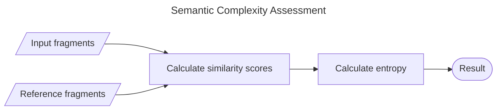
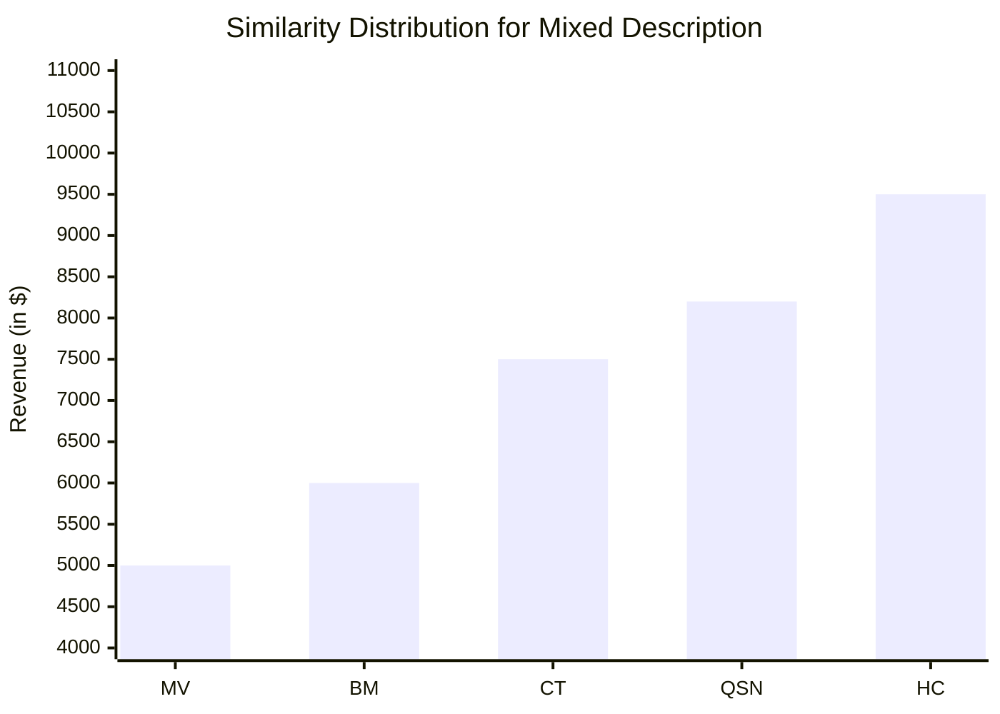
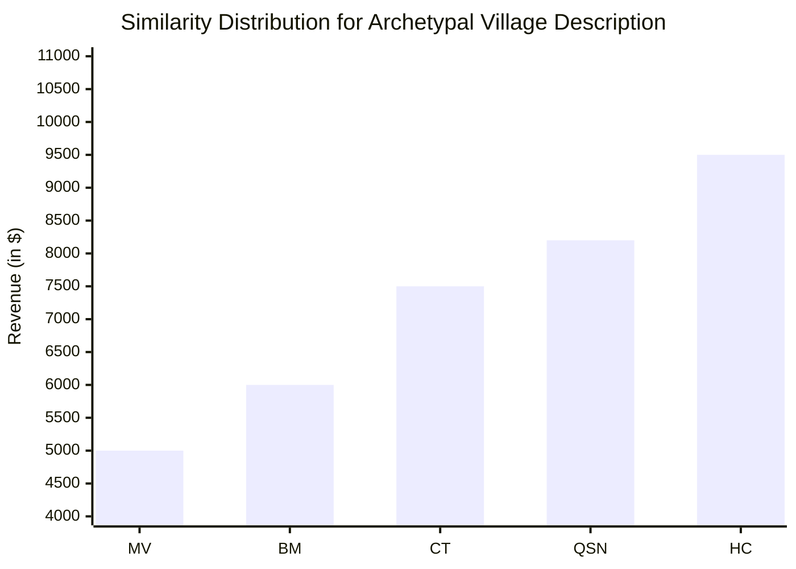
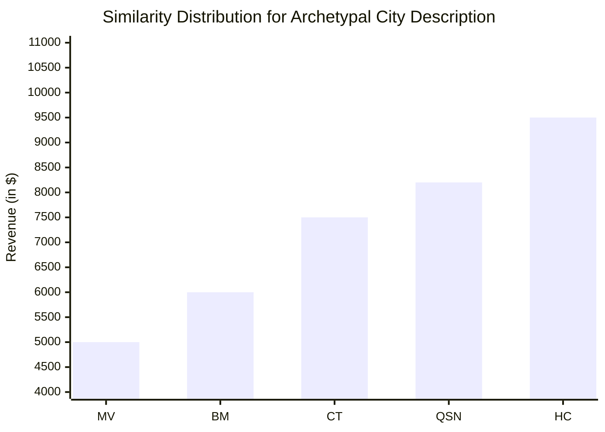

# Assessor
For assessing the complexity of a text description of a person or place, based on archetypal consistency.
This tool can then be used to estimate the conceptual burden that the description will place on the reader.

As a motivating example, consider the following two location descriptions of a bustling metropolis and a quaint village:

> Towering over crowded avenues, the bustling metropolis is a maze of glistening skyscrapers, neon-lit storefronts, and sleek steel bridges.

> Nestled in a lush valley, the quaint village is a tapestry of cobblestone streets, timber-framed cottages, and ivy-covered stone walls.

These are archetypal descriptions of a "bustling metropolis" and a "quaint village", each with details aligned with their respective archetypes.
We could also create a less archetypal description by combining fragments these two archetypal descriptions:

> Nestled in a lush valley, the bustling metropolis is a tapestry of glistening skyscrapers, cobblestone streets, and neon-lit storefronts.

While this is still a logically consistent description, it requires the reader to more carefully each sentence fragment, and incurs additional conceptual burden.
The goal of this tool is to provide an automatic heuristic on that conceptual burden.

# Methodology
The approach relies on a vector embedding tool, which allows us to compare the semantic similarity of two sentences or fragments.
We represent each description as a sequence of fragments, and calculate each fragment's similarity to a suite of predetermined archetypal sentences.
Using the total spread of similarities for a sequence, we can then estimate the overall complexity.
Sequences that closely follow an archetype will have fragments with a very narrow spread of similarities, whereas sequences that do not will have a larger spread.
The overall complexity is represented as an entropy calculation over this spread.
Below is a high level flowchart of the calculation of interest.



## Input Formats
The assessment takes in a sequence of input fragments, which represent the description to be assessed.
Below is an example sequence, based on a prior example.
```js
["nestled in a lush valley", "the bustling metropolis", "a tapestry", "glistening skyscrapers", "cobblestone streets", "neon-lit storefronts"]
```

It also takes in a set of reference fragments, which represent archetypal descriptions to compare against.
An open question is how to best structure these reference fragments.
For now, these fragments are just text snippets describing each archetype.
Below is and example of five archetypal fragments, for a medieval village, bustling metropolis, coastal town, quiet suburban neighborhood, and historical city, respectively.
```js
[
    "Nestled among rolling hills, the quaint medieval village is a charming tableau of thatched-roof cottages, winding cobblestone paths, and colorful flower gardens, with villagers bustling about in traditional attire as the sun sets behind the ancient stone church.",
    "Towering over a sprawling urban landscape, the bustling metropolis is a vibrant mix of glass skyscrapers, crowded streets filled with taxis and pedestrians, and a cacophony of sounds from street vendors and the distant hum of subway trains, all illuminated by the glow of neon lights.",
    "Perched on a scenic cliff overlooking the azure sea, the coastal town is a picturesque haven of pastel-colored homes, quaint fishing boats bobbing in the harbor, and sandy beaches, where the salty breeze carries the laughter of children and the scent of fresh seafood from nearby restaurants.",
    "Tucked away from the hustle and bustle, the quiet suburban neighborhood is a peaceful retreat of tree-lined streets, manicured lawns, and cozy single-family homes, where children ride bicycles and neighbors chat over white picket fences, creating a sense of community and belonging.",
    "Rich in heritage, the historical city is a tapestry of cobblestone streets, grandiose cathedrals, and centuries-old buildings, with every corner revealing stories of the past, as tourists wander through bustling squares filled with street performers and local artisans showcasing their crafts."
]
```

These example inputs will be used as a running example to motivate the rest of the approach.

## Similarity Score Calculation
Similarity scores are returned as a matrix of pairwise similarities between each (input, reference) fragment pair.
This similarity is calculated as the cosine similarity each fragment's respective vector embedding.
These similarities range from 0 to 1, with 0 corresponding to no similarity, and 1 corresponding to the fragments being identical.
Below is an table of similarity scores for the input and reference fragments above.

| | medieval village | bustling metropolis | coastal town | quiet suburban neighborhood | historical city |
| --- | --- | --- | --- | --- | --- |
| "nestled in a lush valley" | 0.000000 | 0.000000 | 0.000000 | 0.000000 | 0.000000 |
| "the bustling metropolis" | 0.000000 | 0.000000 | 0.000000 | 0.000000 | 0.000000 |
| "a tapestry" | 0.000000 | 0.000000 | 0.000000 | 0.000000 | 0.000000 |
| "glistening skyscrapers" | 0.000000 | 0.000000 | 0.000000 | 0.000000 | 0.000000 |
| "cobblestone streets" | 0.000000 | 0.000000 | 0.000000 | 0.000000 | 0.000000 |
| "neon-lit storefronts" | 0.000000 | 0.000000 | 0.000000 | 0.000000 | 0.000000 |

## Entropy Calculation
The total entropy of the fragments is calculated by finding the sequence's average similarity to each reference fragment, and then calculating the entropy of that distribution.
The calculated entropy will range from 0 to 1, with 0 having no disorder, and 1 having total disorder.
For the running example, average similarities are shown in the chart below.


The corresponding entropy is 0.0.

We can also construct corresponding similarity distributions for our two archetypal examples, shown below.





These two distributions result in entropies of 0.0 and 0.0 respectively.

A higher entropy incurs more conceptual burden, so the returned entropy completes the assessment.

## Open Questions
Below are some considerations on how to refine this technique.

1. How do we choose our reference fragments? Could we reinforce the archetype similarity measurement by clustering together several reference fragments around a single archetype?

2. How should similarity be calculated? In the above methodology, a cosine similarity is used to calculated pairwise similarities. Can this be improved?

3. How can we better a multi-distribution entropy? The generated similarity matrix represents a sequence of distributions. Is there a better way of measuring the entropy of these distributions than taking a pointwise arithmetic mean? Could we use a technique that compares these distributions more directly, like the Kullback-Leibler (KL) divergence?
