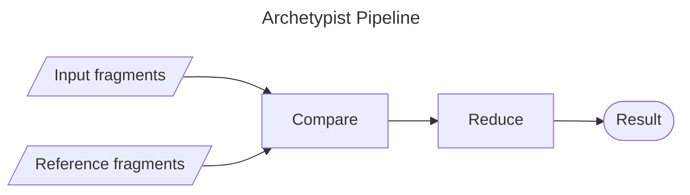

# Archetypist
Archetypist is a tool for assessing the narrative complexity of a description.
Narrative complexity represents how cohesive the ideas within a description are, based on their consistency in following the themes in a set of reference archetypes.
Descriptions with ideas belonging to many different archetypes are considered to have high narrative complexity, whereas descriptions that focus on a single archetype are considered to have low narrative complexity.

## An Example
To motivate the use of Archetypist, consider the following two location descriptions of a bustling metropolis and a quaint village:

> Towering over crowded avenues, the bustling metropolis is a maze of glistening skyscrapers, neon-lit storefronts, and sleek steel bridges.

> Nestled in a lush valley, the quaint village is a tapestry of cobblestone streets, timber-framed cottages, and ivy-covered stone walls.

These are archetypal descriptions of a "bustling metropolis" and a "quaint village", each with details aligned with their respective archetypes.
Each of these descriptions has low narrative complexity, as they stay within well-established archetypes.
Now, we can create a less archetypal description by combining fragments from these two:

> Nestled in a lush valley, the bustling metropolis is a tapestry of glistening skyscrapers, cobblestone streets, and neon-lit storefronts.

While this is still a logically consistent description, it mixes ideas from multiple archetypes, adding narrative complexity.
Archetypist should identify the first two descriptions as having lower narrative complexity than the third.

## Methodology
The process consists of two steps: **compare** and **reduce**, as shown below.
The composition of these steps takes in a set of input fragments, representing the description to be evaluated, and a set of reference fragments, representing archetypes.
It returns a real value representing the narrative complexity of the description.



### Compare
The **compare** step takes in input fragments and reference fragments, and evaluates their pairwise similarities using the [Cohere embed endpoint](https://cohere.com/embed).
This endpoint returns the vector embedding of a fragment, and the similarity of two fragments can be found by calculating the cosine similarity of their respective vector embeddings.
**Compare** applies the [softmax](https://en.wikipedia.org/wiki/Softmax_function) to the similarities for each input fragment, creating a probability distribution for that fragment.
This probability distribution can be interpreted as, "the probability that this input fragment belongs to X reference archetype."
These probabilities are returned as a matrix, whose rows are probability distributions attributed to each input fragment.

### Reduce
The **reduce** step takes in a probability matrix and reduces it to a single value, by tracking the behavior of the probability distribution from fragment to fragment.
It uses [Kullback-Leibler (KL) divergence](https://en.wikipedia.org/wiki/Kullback%E2%80%93Leibler_divergence) to measure the disagreement between the probability distributions of two consecutive fragments.
The resulting sequence represents the amount of local narrative complexity over the course of the sentence.
**Reduce** returns the mean divergence to represent the mean narrative complexity of the sentence.

### Another Example
A concrete example of this workflow can be found in the `example/` directory.
This folder consists of a `reference.json` file containing reference fragments, as well as a `simpleInput.json` and `complexInput.json` containing input fragments for two different descriptions of fantasy realm locations.
`simpleInput.json` contains a narratively simple description of an enchanted forest, whereas `complexInput.json` contains a more complex description of another location.
The `expectedComplexity` value indicated in each input file is continuously validated in the `tests/example.test.ts` file.
These expected complexity values match the intuition that `complexInput.json` contains a more complex narrative than `simpleInput.json`.

# Developer Information

This section contains information for developers working with this repository.

## Compatibility

This project was developed using the following versions:

- **Node.js**: 20.17.0
- **NPM**: 10.8.2
- **TypeScript**: 5.6.2
- **Cohere API**: v2

The Cohere API does not need to be installed on your machine, but you will need an API key for accessing its **embed** endpoint.
You can create an API key using the [Cohere website](https://cohere.com/).

## Building and Running

To set up the project and run tests:

1. Define your Cohere API key:
   - For **PowerShell**:
   ```pwsh
   $env:COHERE_API_KEY=<MY_API_KEY>
   ```
   - For **Bash**:
   ```sh
   export COHERE_API_KEY=<MY_API_KEY>
   ```

2. Install dependencies:
   ```sh
   npm install
   ```

3. Run the tests:
   ```sh
   npm test
   ```

These steps are also replicated in the automatic pipelines declared in the `.github/workflows/` directory.

## Repository Layout

- `lib/`: Contains implementation for the above methodology, with top level **compare** and **reduce** functions in `lib/index.ts`.
- `tests/`: Contains test code to validate this implementation.
- `example/`: Contains a single larger example, validated in the `test/example.test.ts` file.

## Future Improvements

For potential improvements and open issues, see the list of [ticketed issues](https://github.com/tarinyoom/archetypist/issues) in the GitHub repository.
